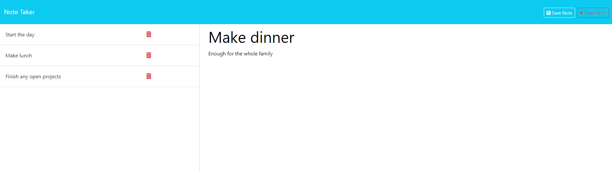

# Backend Notes Taker App

## Description

This project uses Express, Node, NPM, and Heroku. I furthered my knowledge of backend programming with this notes taking app. I was able to create my own API with routes using express.Router to both the html files and api endpoints.

## Table of Contents

- [Installation](#installation)
- [Usage](#usage)
- [License](#license)
- [Questions](#questions)

## Installation

After cloning, running `npm i` within the terminal should install the dependencies needed.

## Usage

[Click here for the Live App deployed on Heroku](https://backend-notes-taker-app-0b812ac78ad1.herokuapp.com/)

Once the dependencies have been downloaded, running `npm start` will start the application locally using localhost. Feel free to use the live page on Heroku also. At first, the user is taken to the home page and in the middle is a "Get Started" button to start taking notes. After clicking the button, the user is brought to the `/notes` endpoint.

Any notes already within the db.json file will be `GET` fetched from the db.json file and displayed on the left side of the page. Every note can be displayed again by click on them and they will be presented within the form on the right side of the page. At the top, if the user wants to clear the page to create a new note the "New Note" button will clear the form on the right for the user to create a new note.

When creating a new note, as the user starts typing a "clear form" button will appear to reset the new note back to a clear form. When the user has input into both "Note Title" and "Note Text" a "Save Note" button will appear so that the user can save the note they have created within the form. Using the "Save Note" button sends a `POST` request to the notes API to save the new note to db.json.

Once saved, a note will be given a newly generated id. The new note will also display on the left with any other previously created notes. Again, all notes are `GET` fetched from the db.json file to the live HTML.

Finally, the user can delete any note by clicking the red trash icon beside each note. This sends a `DELETE` request to delete that specific note based on the unique ID the note was given. Then the new list of notes is displayed for further editing.

## License

Licensed under the MIT license.

[MIT License](https://opensource.org/licenses/MIT)

## Questions

For any questions, please contact WestleyCervantes@gmail.com. Visit [wacwestley30](https://github.com/wacwestley30) for more projects.